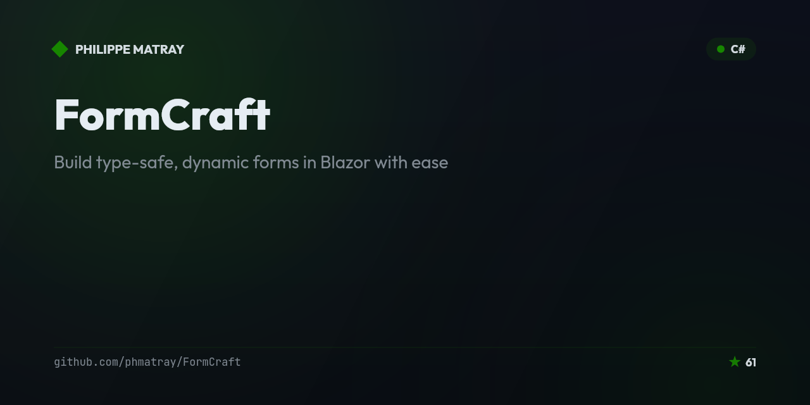

# FormCraft 🎨

<!-- portfolio-toc:start -->

## Table of Contents

- [🌐 Live Demo](#-live-demo)
- [🎉 What's New in v3.1.0](#-whats-new-in-v310)
- [🎉 What's New in v3.0.0](#-whats-new-in-v300)
- [🚀 Why FormCraft?](#-why-formcraft)
- [📊 How FormCraft Compares](#-how-formcraft-compares)
- [📦 Installation](#-installation)
- [🎯 Quick Start](#-quick-start)
- [🏷️ Attribute-Based Forms (NEW!)](#-attribute-based-forms-new)
- [🎨 Examples](#-examples)
- [🛠️ Advanced Features](#-advanced-features)
- [📊 Performance](#-performance)
- [🧪 Testing](#-testing)
- [Tech Stack](#tech-stack)
- [🤝 Contributing](#-contributing)
- [📖 Documentation](#-documentation)
- [🗺️ Roadmap](#-roadmap)
- [💬 Community](#-community)
- [📄 License](#-license)
- [🙏 Acknowledgments](#-acknowledgments)

<!-- portfolio-toc:end -->


<div align="center">

[](https://www.nuget.org/packages/FormCraft/)
[](https://www.nuget.org/packages/FormCraft/)
[](https://www.nuget.org/packages/FormCraft.ForMudBlazor/)
[](https://github.com/phmatray/FormCraft/actions)
[](https://github.com/phmatray/FormCraft/blob/main/LICENSE)
[](https://github.com/phmatray/FormCraft/stargazers)

**Build type-safe, dynamic forms in Blazor with ease** ✨

[Get Started](#-quick-start) • [Live Demo](https://phmatray.github.io/FormCraft/) • [Documentation](https://phmatray.github.io/FormCraft/docs/getting-started) • [Examples](#-examples) • [Contributing](CONTRIBUTING.md)

</div>

---

## 🌐 Live Demo

Experience FormCraft in action! Visit our [interactive demo](https://phmatray.github.io/FormCraft/) to see:

- 🎯 Various form layouts and configurations
- 🔄 Dynamic field dependencies
- ✨ Custom field renderers
- 📤 File upload capabilities
- 🎨 Real-time form generation

## 🎉 Unreleased

- **`.editorconfig` is now actually enforced, and the tree matches it (#301).** The file declared its code-style rules at `warning` severity and `Directory.Build.props` sets `TreatWarningsAsErrors=true` — which together *look* like enforcement and were not: `IDE*` analyzers only run at build time when `EnforceCodeStyleInBuild` is set, and it wasn't, while no CI job ran `dotnet format` either. Nothing anywhere read those severities, so 574 violations had accumulated across 201 files. There is now a Nuke `Format` target (`./build.sh Format`) wrapping `dotnet format --verify-no-changes`, wired into `ci.yml` ahead of the test run, and a one-off pass has cleared the backlog — split into a whitespace commit and a code-style commit so the shape-changing fixes stayed reviewable. Enforcement lives in CI rather than the build on purpose: with warnings-as-errors, build-time style analysis would break `dotnet build` mid-edit over a missing brace.

  ⚠️ **`dotnet format` can corrupt multi-targeted files when it applies fixes** — `FormCraft` is `net8.0;net10.0`, and a fix applied once per target framework can land as a literal `<<<<<<< TODO: Unmerged change` conflict block written into the `.cs` file, which then doesn't compile. Verify mode never writes, so the CI gate is unaffected. After running the formatter to apply fixes, `grep -rl '<<<<<<< TODO' --include='*.cs' .` before committing.

- **A field component now re-reads its configuration when it is handed a different field (#298).** Every MudBlazor field component read its settings once, in `OnInitialized`, and never looked again. Blazor reuses a component instance whenever the render-tree shape matches, so an instance could be given a different field while those cached attributes still described the previous one — and it would go on rendering that field's mask, adornment, input type, numeric format and select options indefinitely. Nothing threw and nothing logged; the field simply showed the wrong thing, plausibly enough that it read as correct.

  **How you hit it:** by **swapping `FormCraftComponent.Configuration`** on a live form — a wizard step, a mode toggle, anything that renders a different form over the same component tree.

  Components now load their configuration in a new `OnFieldConfigurationChanged()` hook, called on first render and again whenever the field changes — guarded by a reference comparison on the field itself, so an ordinary re-render (which happens on every keystroke) costs one comparison rather than a re-read of every attribute. State derived from the configuration is reset with it, including the password-visibility toggle: a revealed password on the old field must not leave the new field's secret rendered in clear text.

  **Collection rows are deliberately *not* keyed.** Blazor matches rows by position, so removing one re-points each surviving component at its neighbour's data. Displayed values are unaffected — those reload from the model — but component *identity* is, and with it any state the value does not restore. Keying the loop on the item was tried and reverted: Blazor compares keys with `Equals`, and item types are constrained only to `new()`, so two `record` or `struct` rows with equal content are a duplicate key and the render throws. On a record-typed item form, adding two empty rows was enough. The remaining identity issue is tracked separately.

  **Writing a custom field component?** Load configuration in `OnFieldConfigurationChanged()` rather than `OnInitialized`, and assign *every* cached property on every call — including back to its default. The override is a reload, not a patch: a property left untouched because the new field does not declare that attribute keeps the previous field's value, which is the same bug in a smaller box.

- **The UI-agnostic adapter machinery moved into `FormCraft` core, so both adapters share one implementation (#279).** Building a second adapter revealed the core/adapter boundary was drawn in the wrong place: `DynamicFormValidator<TModel>` — 242 lines referencing nothing outside `Microsoft.AspNetCore.Components` — the native-required rule, and `.WithNativeRequired(...)` all lived in `FormCraft.ForMudBlazor`, so `FormCraft.ForFluentUI` had to copy them. That is the failure mode #146, #177, #184, #190 and #203 each arrived as: one behaviour implemented twice, drifting apart, reported one bug at a time. All three now live in core, and the Fluent copy is gone.

  **⚠️ Breaking for direct references by namespace.** `DynamicFormValidator<TModel>` is now `FormCraft.DynamicFormValidator<TModel>` rather than `FormCraft.ForMudBlazor.DynamicFormValidator<TModel>`. **No `[Obsolete]` shim was left behind**, deliberately: both packages surface these names in namespace `FormCraft`, so a forwarder visible to the same `using FormCraft;` that reaches the new member would make every existing call site *ambiguous* (`CS0121`/`CS0104`) — breaking the very callers a shim exists to protect — while hiding it in a namespace nobody imports would protect nobody. `.WithNativeRequired(...)` keeps working untouched for that same reason: the namespace never changed. Only code naming `FormCraft.ForMudBlazor.DynamicFormValidator<T>` explicitly, or a pre-compiled assembly bound to the old location, needs a change.

- **Registering two UI adapters now throws in either order (#279).** `AddFormCraftFluentUI()` refused to register alongside MudBlazor, but the reverse order slipped through and produced a container rendering some fields Material and some Fluent — renderer selection is first-match-wins, so there was no error and nothing to point at. The check lives in core (`AdapterRegistration.EnsureSingleAdapter`) and both adapters call it, so it is symmetric by construction rather than by two packages remembering to agree. Registering the *same* adapter twice stays legal.

- **Deleted the UI-framework-adapter seam that nothing used (#279).** `IUIFrameworkAdapter`, `FrameworkAgnosticFieldRenderer` and `UIFrameworkConfiguration` had 8 reference sites between them and **zero** consumers, while `CLAUDE.md` documented the interface with two methods it did not have — so a contributor following the docs would have built against an abstraction nothing calls. The real seam, which both adapters actually ship on, is `FieldRendererBase` + precedence-ordered DI registration, and that is what the docs now describe. `AddFormCraft()` used the deleted interface's *presence* to decide whether to register its built-in renderers; an explicit adapter marker replaces it, pinned by tests. One deliberate change comes with it: only `AddFormCraftMudBlazor()` ever registered that interface, so calling `AddFormCraftFluentUI()` **before** `AddFormCraft()` used to leave core's renderers in place as a silent fallback, while the documented order stripped them. The marker is adapter-neutral, so both orders now agree — which for Fluent means an `IBrowserFile` field renders `Unsupported field type` in either order rather than only in the documented one, since that adapter ships no file-upload renderer.

- **New package: `FormCraft.ForFluentUI`** — renders FormCraft forms with **Fluent UI Blazor v5**, alongside the existing MudBlazor adapter. Switching is a two-line change (`AddFormCraftFluentUI()` plus the `@using`), because the Fluent container keeps the same `FormCraftComponent<TModel>` name in its own namespace (#260)

  **Covers** text (including multiline and password), numeric (including nullable, which keeps `null` rather than coercing to `0`), boolean (checkbox or switch via `BooleanDisplayStyle`), `DateTime`/`DateOnly`/`TimeOnly`, and select from `.WithOptions(...)`. Required fields are announced with `aria-required="true"` and the form renders `novalidate`, matching the MudBlazor adapter's guarantees (#199, #206). Fluent v5 does **not** emit `aria-required` from its own `Required` parameter — measured, not assumed — so FormCraft writes it.

  **`.WithSecurity(...)` is enforced** — rate limiting, CSRF protection, audit logging and field encryption behave as they do in the MudBlazor adapter, and a blocked submission never reaches your `OnValidSubmit` handler (#278). The render-time `NotSupportedException` #260 shipped as a fail-closed guard is gone, replaced by the enforcement it was standing in for.

  **Collection fields render too**, with their item fields dispatched through the same `IFieldRendererService` registry as ordinary fields — so every field type the adapter supports works inside `.WithItemForm(...)` by construction, not by a second implementation that has to be taught each attribute separately (#203, #278). A Fluent `RenderPipelineParityTests` pins that: the same configuration must present identically in both placements, `aria-required` included.

  **Field groups render with their layout** — `ShowInCard()` gives a `FluentCard`, `WithColumns(n)` spreads the group across Fluent's 12-column grid, and ungrouped fields still render after the groups (#278). `ShowInCard(elevation: n)` is mapped onto Fluent's five shadow buckets rather than ignored, since Fluent has no equivalent of MudBlazor's integer elevation scale.

  **Autocomplete, multi-select, file upload, lookup and LOV all render** (#278). Two things worth knowing: the lookup and LOV pickers are **inline panels rather than modals**, because Fluent v5's dialog service draws nothing unless the host app adds a `FluentDialogProvider` and a Browse button that silently did nothing would be worse than a different presentation; and a required **file upload** is announced by a visible `*` on its label plus an `aria-describedby` hint on the Browse button rather than `aria-required` on the hidden input, following the same measurement as #262.

  **Custom renderers ship too** — slider, rating and colour picker, via `.WithCustomRenderer(typeof(FluentUISliderRenderer))` and friends. The rating is a row of labelled buttons rather than Fluent's `FluentRatingDisplay`, which exposes `Value` but no `ValueChanged` and would have shown a score it silently refused to change.

  **Run the showcase** with `cd FormCraft.DemoFluentApp && dotnet run`. It is a second demo app rather than a page in the existing one because the adapters cannot share a DI container and Blazor has no per-subtree service provider.

  **One adapter per application:** registering both adapters throws, because renderer selection is first-match-wins and a mixed container would silently render a half-Material form. Since #279 the check is symmetric — whichever registration runs second throws — so the guard no longer depends on which order you happened to write. Fluent UI Blazor v5 is still an RC, so this package depends on a prerelease.

- **Collection item fields now render through the same components as every other field.** Fields inside `.WithItemForm(...)` used to be built by a second, hand-written renderer, so every presentation feature had to be implemented twice — which is where #146 (`Variant`), #177 (`ShrinkLabel`), #184 (adornments) and #190 (`Required`) each came from, one bug report at a time. That renderer is gone: item fields go through `IFieldRendererService` like everything else, and inherit present and future field capabilities by construction rather than by vigilance (#203)

  No API changed, and a form that configures nothing renders as before. Settings that an item field previously accepted and silently ignored now take effect:

  | Setting on a field inside `.WithItemForm(...)` | Before | Now |
  |---|---|---|
  | `.AsPassword(enableVisibilityToggle: true)` | masked, but no show/hide eye | the eye is rendered and works |
  | `DisplayStyle = BooleanDisplayStyle.Switch` on a `bool` | always a checkbox | renders a switch |
  | `MinDate` / `MaxDate` on a date | ignored | honoured |
  | typing into a date field | picker only | editable, like a standalone date field |
  | `Min` / `Max` / `Step` on a numeric | ignored | honoured |

  **Worth knowing:** a `bool` item field gains `DisplayStyle`, not the whole shared presentation set — `MudCheckBox` has no `Variant`, `Placeholder` or adornment to give it. Configuring those on a `bool` stays inert, exactly as it is on a standalone `bool` field. `.WithAttribute("Required", true)` was already path-independent as of #204 and is unchanged here.

- **⚠️ `.WithAdornment(...)` on an ordinary date field is now honoured.** It used to be accepted and silently dropped on the *component* path, the mirror image of the collection-path bug #217 fixed — `MudDatePicker` defaults to `Adornment.End` with its own calendar icon, and the component declined to bind an adornment at all rather than erase it. It now supplies MudDatePicker's own defaults, so an unconfigured field still renders End + the calendar icon and a configured adornment wins (#203)

  If you had `.WithAdornment(..., Adornment.Start)` on a date field and had not noticed it doing nothing, it will now render — and, being a real start adornment, it pins the label, so the `ShrinkLabel` diagnostic will now report it.
- **`Mask` works — on both render paths.** `.WithAttribute("Mask", …)` was accepted and silently did nothing anywhere: FormCraft stores the mask as a string, MudBlazor's parameter takes an `IMask`, and the conversion had never been written. The component path read the string into a property whose only consumer was a `GetMask()` stub that returned `null` and that nothing called; the collection path deliberately did not forward it at all, precisely so the two would not diverge. The conversion now exists and both paths bind it, so a mask applies to an ordinary field and to one inside `.WithItemForm(...)` alike (#211)

  ```csharp
  .AddField(x => x.Phone, field => field
      .WithLabel("Phone")
      .WithAttribute("Mask", "(000) 000-0000"))   // ← was inert, now masks as you type
  ```

  Pattern characters are `0` (digit), `a` (letter) and `*` (letter or digit); every other character is a literal the mask inserts for you — so typing `5551234567` above yields `(555) 123-4567`. A blank pattern (`""` or whitespace) means *no mask*, so a setting that binds to empty leaves the field alone rather than making it reject every keystroke. Unlike `.AsPassword()` + `Lines` (#207), a mask combined with `AsTextArea(lines: > 1)` is honoured in full — you get a masked `<textarea>`.

  **Three things to check before you upgrade**, if you already pass `Mask` — it did nothing until now, so all three are newly reachable:

  1. **The model stores the *masked* text.** With the mask above, `model.Phone` becomes `"(555) 123-4567"`, not `"5551234567"`. Validation, database columns and APIs keyed to raw digits will see the delimiters. This is still the default, but it is no longer the only option: `.WithMask("(000) 000-0000", cleanDelimiters: true)` stores `"5551234567"` instead — see the `.WithMask(...)` entry below (#265).
  2. **An existing value that doesn't fit the pattern is displayed wrongly** — while the model quietly keeps the original. Either it renders as an empty field, or, less obviously, the mask keeps the characters that happen to fit and drops the rest. The user submits without touching the field and the old value survives. FormCraft now **says so** instead of leaving you to find it in a bug report: a warning under the `FormCraft.ForMudBlazor.MaskedValue` category names the field and the pattern, on both render paths, once per field — a fifty-row collection reports once, not fifty times (#266). It judges whichever mask the field actually renders with, a factory supplied via `.WithMask(...)` included.

      **What it reports** is the mask changing what the value *means*, not merely how it looks (#283):

      | Stored | Renders as | Reported |
      |---|---|---|
      | `"N/A"` | `""` | ✅ the value was rejected outright |
      | `"+1 555 123 4567"` | `(155) 512-3456` | ✅ **a different phone number** — the country code was consumed as the area code and the last digit dropped |
      | `"N/A5551234567"` | `(555) 123-4567` | ✅ the digits survived, the `N/A` marker did not |
      | `"5551234567"` | `(555) 123-4567` | — reformatting is the mask working |
      | `"555 123 4567"` | `(555) 123-4567` | — same, even though the stored value had its own separators |
      | `"123 45 6789"` under `000-00-0000` | `123-45-6789` | — same again, and the separators aren't the mask's either |

      The `+1` row is the one worth knowing about: nothing looks wrong on screen, so the message quotes the text the field displays, which is what lets you check it against the record.

      **Reformatting stays silent however the value happens to be punctuated.** The rule reduces both sides to the characters that carry the data — dropping punctuation, the mask's own literals, and its placeholder padding — and compares those, so stored data keeps its meaning whether it arrives as `5551234567`, `555 123 4567` or `555.123.4567`, and whether or not those separators are the ones the mask spells. That matters because legacy data is punctuated however whoever stored it felt like, which is rarely the way a newly-added mask is. `cleanDelimiters` does not enter into it either way. A mask FormCraft cannot read like that — a `RegexMask` from the factory overload, or one carrying a `Transformation` — falls back to reporting outright rejection only, rather than guessing.

      **It also fires for values that arrive after the field is on screen** (#283) — the async-fetch case, where the model is populated once the request resolves and the field was empty at first render. It was previously checked only at initialisation, so precisely the legacy data most likely to predate the mask went unreported. It never fires for a value *you* type, and never for a field you clear: it reports stored data, not live editing.

      The diagnostic reports only — the stored value is never rewritten, on any path, including read-only views. Still worth auditing stored data against the pattern before turning a mask on; the warning tells you where to look. Silence it by configuring that log category off.
  3. **Masked fields render through MudBlazor's `MudMask`**, which MudBlazor documents as *"recommended to be used in WASM projects only because it has known problems in BSS, especially with high network latency"*. On Blazor Server, test the field under realistic latency before shipping it.

  A field that configures no mask is untouched by all of this.

- **`.WithMask(...)` — a typed builder for masks, replacing the `"Mask"` magic string.** The entry above made masks work; the only way to reach one was still `.WithAttribute("Mask", "…")`, which is undiscoverable, unchecked by the compiler, and one typo away from silently doing nothing — the defect #204 closed for `.WithNativeRequired()`. There is now a typed builder, and it reaches two configurations the string never could (#265)

  ```csharp
  .AddField(x => x.Phone, field => field
      .WithMask("(000) 000-0000"))                        // model stores "(555) 123-4567"

  .AddField(x => x.Phone, field => field
      .WithMask("(000) 000-0000", cleanDelimiters: true)) // model stores "5551234567"

  .AddField(x => x.Pin, field => field
      .WithMask(() => new RegexMask("^[0-9]{0,4}$")))     // any MudBlazor IMask
  ```

  | Configuration | Resolved mask | Model receives |
  |---|---|---|
  | `.WithMask("0000-0000")` | `PatternMask` | `"1234-5678"` (delimited) |
  | `.WithMask("0000-0000", cleanDelimiters: true)` | `PatternMask` with `CleanDelimiters = true` | `"12345678"` |
  | `.WithMask(() => new RegexMask(…))` | what the factory returns | per that mask |
  | `.WithAttribute("Mask", "0000-0000")` | `PatternMask` | `"1234-5678"` — unchanged |
  | blank or whitespace pattern | none | value unchanged |

  **`cleanDelimiters` is the answer to point 1 above.** The model storing the delimited text used to be unavoidable, because `PatternMask.CleanDelimiters` was unreachable from FormCraft. It is opt-in, so the default keeps #211's behaviour and a form you do not touch is unaffected.

  **A pre-built `IMask` used to be discarded silently.** `.WithAttribute("Mask", new RegexMask(…))` — the natural thing for a MudBlazor user to write — compiled, built and rendered while doing nothing at all: both render paths read that key as `string?`, so an `IMask` failed their type test and fell back to `null`, putting `RegexMask`, `BlockMask` and `MultiMask` out of reach. The new overload writes a separate, correctly-typed key.

  **Why a factory and not the mask itself.** A mask is not a value: MudBlazor's `BaseMask` carries the live `Text`, `CaretPos` and `Selection` of the input it is attached to. One field configuration is shared by every row of a collection, so a mask stored in it would be handed to every row at once — and `MudMask.SetMask` keeps the object it is given rather than copying it whenever the type differs from the `PatternMask` it seeds itself with, which is the case for every `RegexMask`, `BlockMask` and `MultiMask`. Taking `Func<IMask>` gives each rendered field its own instance and keeps the built configuration immutable. Return the **same implementation type** on every call: MudBlazor preserves the user's text and caret only when the incoming mask matches the type it already holds, and a render happens on every keystroke.

  ⚠️ **A regex mask is matched against *partial* input**, so its pattern must accept prefixes: `^[0-9]{0,4}$`, never `^[0-9]{4}$`, which never matches a shorter prefix and so blocks every keystroke.

  `.WithAttribute("Mask", "…")` keeps working and is unchanged — this is additive, not a migration. Both render paths resolve all of it through the same `TextMaskMap.Resolve`, so an ordinary field and one inside `.WithItemForm(...)` agree by construction. One wrinkle if you *mix* the two on a single field: the raw form sets only the pattern, so a `cleanDelimiters: true` from an earlier `.WithMask(...)` call on that field stays in effect. Prefer `.WithMask(...)`, which clears whatever the other overload configured.

- **Required fields are now announced to assistive technology, on both render paths.** A `.Required("…")` field rendered `aria-required="false"` — not merely silent, but an affirmatively wrong statement to a screen reader — so a screen-reader user got no indication which fields were mandatory until submission failed. That is a WCAG 2.1 **3.3.2 Labels or Instructions** (Level A) failure. Both the ordinary field path and the collection item path now resolve MudBlazor's `Required` from `.Required(...)`, so the field is announced identically inside and outside `.WithItemForm(...)` (#199)

  **What comes with it.** MudBlazor drives three things from one flag, so the visible `*` asterisk and the HTML5 `required` attribute return alongside the ARIA annotation — they are not separable. The asterisk is itself a *visible* WCAG 3.3.2 identification. The HTML5 attribute is **inert for validation**: FormCraft forms render `novalidate` (#206), so the browser runs no constraint validation and messages still come from your validator. This reverses the collection-path half of #190 deliberately; what #190 actually fixed — the two paths disagreeing — stays fixed, and `RenderPipelineParityTests` now compares `aria-required` on both.

  **Opting out — and why you probably should not.** `.WithNativeRequired(false)` on a `.Required(...)` field suppresses the decoration while keeping the validation. The explicit attribute wins in both directions. ⚠️ **Reach for it to drop an unwanted asterisk and you reintroduce the exact Level A failure this entry describes:** the input goes back to reporting `aria-required="false"` on a genuinely required field, which is worse than saying nothing. If the asterisk is the problem, restyle `.mud-input-required` instead — that removes the visual marker without lying to a screen reader.

  **Coverage is deliberately uniform.** Text, numeric, date, select, multi-select, autocomplete, lookup, LOV **and boolean** fields all announce it, on both render paths. That uniformity is the point rather than a bonus: once required text fields carry an asterisk, *absence* of one stops meaning "not annotated" and starts meaning "optional", so a required Country select or "I accept the terms" checkbox left unmarked would actively mis-signal — a worse outcome than the uniform silence this replaced.

  Checkboxes needed a different mechanism: `MudCheckBox` and `MudSwitch` emit no `aria-required` of their own, so FormCraft supplies it through `UserAttributes` — which works there precisely because nothing downstream overwrites it, unlike `MudInput`.

  **File upload is no longer the exclusion** — it is covered by a different mechanism, see the #262 entry below.

- **Required file-upload fields are identified too, at the label and the button.** #199 left file upload as the one field type a `.Required(...)` call did not mark, which was defensible while nothing was marked — and stopped being defensible the moment everything else was. Beside eight asterisked field types, an unmarked required upload actively reads as *optional*, to sighted and screen-reader users alike: a stronger wrong signal than the uniform silence it replaced, and the same WCAG 2.1 **3.3.2** (Level A) failure #199 set out to fix (#262)

  **Why not just bind the flag.** FormCraft renders `MudFileUpload`'s real `<input type="file">` at `opacity-0` with `tabindex="-1"` beneath a custom drop zone, so it is deliberately outside the tab order. An annotation there satisfies a DOM assertion while reaching no keyboard or screen-reader user — so both upload components (single **and** multiple) mark the requirement where the user actually is: a visible `*` in the field's own label, and `aria-describedby` on the **Browse** button — the affordance that really takes focus — resolving to a visually-hidden "*&lt;Label&gt;* is required." A field with a blank label still gets the button description, which is then its only channel.

  **`Required` on `MudFileUpload` is deliberately NOT bound**, and that was measured rather than assumed. It was tried as belt-and-braces for assistive technology that walks the accessibility tree instead of the tab order, and reverted: `MudFormComponent` raises its own `RequiredError` once the flag is set, and outside a cascaded `EditContext` — a standalone `IFieldRendererService.RenderField`, which is supported and used — clearing a required upload printed MudBlazor's own **"Required"** under the drop zone, in different words from your validator's message. A real wrong message in exchange for a speculative benefit is a bad trade.

  **Styling the marker.** The asterisk is a text node in a `span.formcraft-required-marker`, not MudBlazor's CSS `::after` — MudBlazor's only `mud-input-required` rule targets a `.mud-input-label` descendant that this span does not have. So restyle **`.formcraft-required-marker`** for upload fields; the `.mud-input-required` advice in the #199 entry above does not reach them. `.WithNativeRequired(false)` suppresses both channels, as everywhere else.

- **In the MudBlazor adapter, every control that removes or disables itself now moves keyboard focus deliberately.** #281 fixed one such control — the upload **Clear** button — and this finishes the sweep across the five that were left, all the same WCAG 2.1 **2.4.3 Focus Order** (Level A) failure: activating them left focus on `<body>`, so the next <kbd>Tab</kbd> restarted from the top of the document (#318)

  | Control | Focus now goes to |
  |---|---|
  | a file **chip's close** button (multiple-file upload) | that field's **Browse** button — it carries #262's `aria-describedby`, so a required field announces itself the moment removal makes it unsatisfied |
  | a collection row's **delete** | the delete button taking the vacated slot, else the previous row's, else **Add**, else the collection header |
  | **Add**, on the click that reaches `MaxItems` | the new row itself — so <kbd>Tab</kbd> goes straight into its fields, and deliberately *not* its Delete button, where <kbd>Enter</kbd> would undo the add |
  | **Move up** / **Move down**, when the item lands at an end and the button becomes disabled | the same row's still-enabled counterpart, so focus follows the *item* rather than sitting on an index that now controls a different one |

  Focus is moved only where it would actually have been lost: adding a row while **Add** survives (the default, since `MaxItems` is 0) leaves focus on Add, and removing one file chip of several leaves focus on the chip stack — in both cases the control the user is standing on is retained, so moving focus would cost them a tab back rather than help.

  The swallow-safe focus call is shared (`FocusRestore`), so a failed focus can never turn a completed removal into an unhandled exception — which on Blazor Server would tear down the circuit. Two behaviours worth knowing: a single-item collection cannot be reordered at all (both buttons are disabled and the handlers no-op), and with `MinItems` reached *and* adding disallowed, focus lands on the collection's header, which carries its label.

  ⚠️ **`FormCraft.ForFluentUI` is not covered.** Its collection field carries the same self-unmounting Add/delete and self-disabling reorder controls and still drops focus; porting `FocusRestore` across is tracked separately.

- **Clearing a file upload no longer throws keyboard focus away.** Both upload components render **Clear** inside an `@if` gated on the very value the button's own handler removes, so activating it unmounted the element the user was standing on and focus fell to `<body>` — the next <kbd>Tab</kbd> restarted from the top of the document instead of resuming where the user was, a WCAG 2.1 **2.4.3 Focus Order** (Level A) failure. Focus now moves deliberately to that field's **Browse** button (#281)

  **Why Browse is the target.** It is the affordance that resolves the state clearing has just created, it sits where Clear used to be in the tab order, and it carries the `aria-describedby` requirement description from #262 — so on a required field, focusing it **announces the requirement at the exact moment clearing makes the field unsatisfied**, which is precisely the moment that description was previously unreachable. Focus lands on the *cleared* field's Browse button, not on the first upload in the document. Single- and multiple-file uploads share the reference and the focus helper on `MudBlazorFileUploadComponentBase`; the `@ref` and the call site are still one line in each component's own markup, so the guarantee is held by a test per component rather than by construction.

  Nothing else moved: the drop-zone visuals, the hidden input's `tabindex="-1"`/`opacity-0` and Clear's visibility rule are all still as #262 pinned them. A focus move that cannot complete — a disposed component, a dropped circuit, no live element behind the reference — is swallowed rather than raised, since the clear itself has already succeeded by then.

- **Date collection item fields honour a configured adornment — and keep their calendar icon.** `.WithAdornment(...)` on a date field inside `.WithItemForm(...)` was accepted and silently dropped: the date path refused the forward because `MudDatePicker` defaults to `Adornment.End` with its own calendar icon, and forwarding an unset adornment would have erased it. Both now hold — MudDatePicker's End + calendar icon is the **default**, and a configured adornment wins (#217)

  **Worth knowing if you configure a start adornment on a date item field:** it is now really rendered, so it really does pin the label — and the `ShrinkLabel` diagnostic now says so, where it used to stay quiet because the adornment was being discarded.

- **Numeric collection item fields honour a configured `Culture`.** The collection path hard-coded `CultureInfo.InvariantCulture` while an ordinary numeric field took a configurable one, so the same model with the same configuration parsed decimals differently inside and outside `.WithItemForm(...)` — typing `1,5` in a French locale gave different results depending on where the field sat. `InvariantCulture` remains the **default**, so a form that configures nothing is unaffected (#218)

- **Collection item fields typed `long`, `float`, `short` or `byte` rendered *nothing at all* — they now render.** `RenderItemField` dispatched on `string`/`int`/`decimal`/`double`/`bool`/`DateTime` only, so a field of one of those four types emitted no input, no label and no validation message: an empty row, while the identical field outside a collection worked. `MudBlazorNumericFieldRenderer` has always accepted all seven numeric types (#209)

  A test now drives the collection path off `MudBlazorNumericFieldRenderer.CanRender` rather than a copied list, so a type added to one and not the other fails the build.

- **⚠️ Breaking: `IFieldConfiguration.Validators` is now `IReadOnlyList<>`; use `AddValidator(...)` to add one.** It was a concrete `List<>`, which made `config.Fields[i].Validators.Add(v)` compile, run, and **silently do nothing** — the object-typed view exposed through `IFormConfiguration.Fields` projects its validators from an underlying typed list, and because `List<>`'s members are not virtual it could only hand back a materialised snapshot. Adding to that snapshot never affected validation. Making the property an interface turns that silent no-op into a compile error (#155)

  | before | after |
  |---|---|
  | `field.Validators.Add(validator)` | `field.AddValidator(validator)` |

  **`AddValidator(...)` has existed since 3.1.0**, so you can migrate before upgrading and the change is then mechanical. Reading `Validators` — iterating, indexing, `.Count` — is unchanged. `AddValidator` also lost its default interface implementation: it could not be correct against a read-only property, and a custom `IFieldConfiguration` that forgets it should fail to compile rather than inherit a silent no-op.

- **Numeric adornments now take an `onClick`, typed to the field's own value.** The numeric `WithAdornment` overloads added in #191 had no handler, because at the time the string overload's was read by neither render path. #192 made it live, so the reason expired and the gap remained. Both numeric overloads now accept `Action<TValue?>` — **not** the string overload's `Action<string?>`, which is right there only because that field's value happens to be a string — and the handler fires on both render paths, including inside `.WithItemForm(...)` (#215)

  ```csharp
  .AddField(x => x.Quantity, field => field
      .WithAdornment(Icons.Material.Filled.Numbers, Adornment.End,
          onClick: quantity => Recalculate(quantity)))   // receives int?, not string?
  ```

  A numeric adornment with **no** handler still renders a plain icon rather than a focusable button, matching #216.

- **FormCraft now warns when the password visibility toggle discards a configured adornment.** A field has one adornment slot, and `.AsPassword(enableVisibilityToggle: true)` claims it for the show/hide eye — so an adornment configured alongside it, and any `onClick` with it, was dropped without a word. Since #192 made that handler work everywhere else, this was the last place it silently did nothing. Nothing about the rendering changes (one slot cannot hold both); the warning names the two ways out — remove the adornment, or pass `enableVisibilityToggle: false`. Logged under the `FormCraft.ForMudBlazor.PasswordAdornment` category (#219)

- **The `ShrinkLabel` diagnostic no longer warns about an adornment the field never draws.** It judged the *configured* `Adornment` attribute regardless of whether the component binds one — so date, select, autocomplete, lookup and file-upload fields told you to remove a `ShrinkLabel=false` that was in fact being honoured. It now judges what the component actually **renders**, which is the rule the collection item path has followed since #183. Text and numeric fields do render their adornment, so their (correct) warnings are unchanged (#212)

- **`Format` and `ShowSpinButtons` now take effect on numeric fields — on both render paths.** Both were resolved in the numeric components' `OnInitialized` and then never bound, so `.WithAttribute("Format", "N2")` and `.WithAttribute("ShowSpinButtons", false)` were silently discarded. `ShowSpinButtons` is part of the public `INumericFieldComponent<TModel, TValue>` contract, so the library advertised a setting it dropped. The collection item path never forwarded either, and now does (#208)

  **This is a behaviour change** for any form already passing them: they start working. `ShowSpinButtons` defaults to `true`, matching MudBlazor, so a field that configures neither renders exactly as before.

- **`.WithInputType("number" | "date" | "time")` now renders the type it names.** All three fell through to `type="text"`, so a string field configured with one lost its mobile numeric keypad or its native date/time picker — silently, with nothing reported. The recognised set is now `email`, `password`, `tel`/`telephone`, `url`, `search`, `number`, `date` and `time`; anything else still falls back to `text` rather than throwing (#210)

  **Not a change to auto-generated forms.** `AddFieldsAuto()` emits these same strings for numeric, date and time *properties*, but those render through `MudNumericField` / `MudDatePicker` / `MudTimePicker`, which never consulted this mapping — it applies to `string` fields only. Pinned by a test so the scope is measured rather than assumed.

- **`.WithNativeRequired()` replaces the `.WithAttribute("Required", true)` magic string — and now works on ordinary fields too.** #193 introduced the native-required opt-in as a documented raw string: undiscoverable by IntelliSense, unchecked by the compiler, and one typo (`"required"`) away from silently doing nothing. It is now a typed builder method, declared for every field type rather than strings only. The raw string keeps working and writes the same attribute, so this is additive (#204)

  ```csharp
  .AddField(x => x.Email, field => field
      .Required("Email is required")   // the validation — server-side, your message
      .WithNativeRequired())           // the decoration — asterisk + HTML5 attribute
  ```

  **The opt-in was collection-only, and no longer is.** A raw `"Required"` attribute was read solely by `CollectionFieldComponent`, so the escape hatch was honoured inside `.WithItemForm(...)` and silently ignored outside it. Both render paths now honour it, and `RenderPipelineParityTests` compares them. ⚠️ **Superseded in this same release by #199** (see above): `.Required(...)` on its own no longer emits nothing — it now sets the flag on both paths, so the field is announced to assistive technology. What survives from this entry is that the *explicit* attribute is honoured on both paths and wins over the inference in either direction.

- **`novalidate` is now a rendered attribute on the form, not something applied by a script afterwards.** The library documents its forms as `novalidate` — server-side validation, messages from your configured validator, no native browser bubbles — but the attribute was bolted on after first render with `JSRuntime.InvokeVoidAsync("eval", "document.querySelector('form')?.setAttribute(…)")`. That missed in three ways: it marked the **first** form in the document rather than FormCraft's (so a search or login form higher up the page got marked instead, and with two FormCraft forms the second was never marked at all), it never ran during **prerender/SSR**, and it failed silently. Being `eval`, a strict **CSP** blocked it outright — silently and totally. The attribute is now in the markup, so it targets the right form by construction, survives prerender, and needs no JavaScript (#206)

  **Worth knowing if you rely on it.** This is the guarantee `.WithAttribute("Required", true)` (#193) depends on: that opt-in emits a genuine HTML5 `required`, and on a page where the script missed, the browser really did enforce it — producing exactly the native validation bubbles this library says it never produces.

- **A password field combined with a multi-line setting was rendering in clear text — on both render paths. Masking now wins.** `.AsPassword()` together with `.AsTextArea(...)` (or any `Lines > 1`) made MudBlazor emit a `<textarea>`, and a textarea has no `type` attribute, so the masking was silently dropped and the credential was displayed. Unlike #189 this was not a drift between the two render paths — both had the same gap. Such a field now renders **masked, on a single line**, and FormCraft logs a warning naming the field and the line count it dropped (#207)

  ```csharp
  .AddField(x => x.Secret, f => f
      .WithLabel("Password")
      .AsPassword()
      .AsTextArea(lines: 4))   // ← was clear text; now masked on one line, with a warning
  ```

  **Why masking wins rather than the line count.** There is no such thing as a masked `<textarea>`, so the combination can never be honoured as written — and of the two settings, `.AsPassword()` is an explicit security request while the line count is presentation. Rejecting the combination at build time was the alternative, but `.AsTextArea(...)` and `.AsPassword()` live in different assemblies and either may be called first, so no builder method ever sees both; the check would have had to throw from `Build()`, turning an insecure-but-working form into a startup crash. The warning is logged under the `FormCraft.ForMudBlazor.PasswordMasking` category — filter it out if you have a reason to keep the combination.

- **A decorative adornment no longer renders as a focusable button.** An adornment configured with `.WithAdornment(...)` and *no* `onClick` was drawn as a real `<button>` on ordinary fields — inert to click, but a stop in the tab order, so keyboard and screen-reader users landed on a control that does nothing. The component path bound its click callback unconditionally; the collection path never did, so the same configuration produced different markup inside and outside `.WithItemForm(...)`. Both now render a plain icon (#216)

  **Worth knowing if you assert on markup.** A handler-less adornment no longer matches `button.mud-input-adornment-icon-button`. Adornments configured *with* a handler are unchanged — still a real button, still clickable.

- **Password fields inside collection item forms were rendering in clear text. They now mask.** A field configured with `.AsPassword()` inside `.WithItemForm(...)` rendered as a plain-text input: the characters the user typed were displayed on screen. The identical call on an ordinary field masked correctly. The collection render path never emitted `InputType` at all, so nothing failed and nothing warned — the credential was simply visible (#189)

  ```csharp
  .AddCollectionField(x => x.Credentials, c => c.WithItemForm(item => item
      .AddField(x => x.Secret, f => f
          .WithLabel("Secret")
          .AsPassword())))   // ← was clear text, now masked
  ```

  **Behaviour change to be aware of.** Forms that already use `.AsPassword()` inside a collection **start masking** — the characters stop being visible. If any workflow relied on reading those values off the screen, it will notice. The same path now also forwards `Lines`, `MaxLength` and `autocomplete`, so multi-line item fields honour their configured height, length limits apply, and password managers can fill item fields.

  **Scope.** The visibility-toggle eye that `.AsPassword()` puts on an ordinary field is still not drawn on an item field; the masking no longer depends on it. `Mask` was left unimplemented on **both** render paths at the time — FormCraft stored it as a string, MudBlazor wanted an `IMask`, and the conversion had never been written — so `.WithAttribute("Mask", …)` was inert everywhere rather than newly inconsistent; that has since been closed (see the `Mask` entry under **Unreleased**). The parity test introduced with the #184 entry below now compares `InputType`, `Lines`, `MaxLength` and `autocomplete` instead of listing them as known divergences.

- **`.WithAdornment(...)`'s `onClick` handler now fires — on both render paths.** The parameter was accepted, documented and then thrown away: `WithAdornment` never wrote it anywhere, so a search or visibility-toggle icon rendered, invited a click, and did nothing. It now runs on an ordinary field and on one inside `.WithItemForm(...)` alike, receiving the field's current value (#192)

  ```csharp
  .AddField(x => x.Query, f => f
      .WithAdornment(Icons.Material.Filled.Search, Adornment.Start,
          onClick: value => Search(value)))   // ← now runs
  ```

  **Behaviour change.** Code that already passed a handler starts executing it. That is the fix — a handler was never meant to be inert — but it is a real change for any form that has been passing one since v3.x. An adornment configured *without* a handler does nothing when clicked, exactly as before; its markup is also unchanged on both paths (an ordinary field has always rendered its adornment as a button, a collection item field as a plain icon).

  Note that `.WithAdornment(...)` overwrites **all four** of its settings, the handler included. Re-configuring a field that a shared helper already gave a searching adornment — `.WithAdornment(Icons.Material.Filled.Email, Adornment.End)` — yields a plain decorative icon, not one that quietly still runs the helper's handler.

  **Scope.** The handler is typed `Action<string?>` and declared on string fields, so numeric item-field adornments remain inert; date item fields are unchanged, keeping MudBlazor's own calendar adornment. One combination still discards the handler: `.AsPassword(enableVisibilityToggle: true)` claims the adornment slot for its own show/hide toggle, so a handler passed alongside it does not run — a field can only have one adornment.

- **Numeric fields render adornments, and `.WithAdornment(...)` finally reaches them.** The numeric field components emitted no `Adornment`, `AdornmentIcon` or `AdornmentColor` at all, so an adornment configured on a numeric field was accepted and silently dropped. Since #184 the *collection* path did render it, which left the same configuration showing an icon inside `.WithItemForm(...)` and nothing outside it (#191)

  ```csharp
  .AddField(x => x.Quantity, f => f
      .WithAdornment(Icons.Material.Filled.Numbers, Adornment.End))   // ← now compiles, and renders
  ```

  `WithAdornment` was declared only on `FieldBuilder<TModel, string>`, so a numeric field could not call it at all — the sole way to configure one was the untyped `.WithAttribute("Adornment", …)` escape hatch, which is how the gap stayed invisible. It now has numeric overloads covering nullable numerics too, constrained to `INumber<T>` rather than to `struct` so it is not offered on `bool` or `DateTime` fields, where MudCheckBox has no adornment concept and MudDatePicker keeps its own calendar icon.

  **Behaviour change.** A form that already configures a numeric adornment through raw `.WithAttribute(...)` starts showing the icon it asked for. That is the whole of it: unconfigured numeric fields are untouched, because MudNumericField's own default is `Adornment.None`. The `ShrinkLabel` diagnostic is **not** affected — it reads the *configured* adornment rather than the rendered one, so a numeric field pairing a start adornment with `ShrinkLabel="false"` already warned before this change. (That the diagnostic judges configuration rather than rendering is a separate defect: it still warns on date and select fields, which render no adornment of ours at all.)

- **Collection item fields no longer carry the HTML5 `Required` attribute.** `.Required("…")` inside `.WithItemForm(...)` set `Required="true"` on the underlying MudBlazor component, so the rendered `<input>` came out with `required` and `aria-required="true"` — while the identical call on an ordinary field did not. That contradicted the library's validation stance: validation is server-side, forms render `novalidate`, and messages come from the validator you configured. Item fields now match ordinary fields (#190)

  ```csharp
  .AddCollectionField(x => x.Items, c => c.WithItemForm(item => item
      .AddField(x => x.ProductName, f => f
          .WithLabel("Product")
          .Required("Product name is required"))))   // ← validates; no HTML5 required attribute
  ```

  **Validation is unchanged.** `.Required(...)` still registers its validator, a blank item field still fails validation, and the message is still the one you passed.

  **⚠️ Superseded within this same release by #199 — read that entry above for the behaviour that actually ships.** What this change fixed is that the two render paths *disagreed*, and that stays fixed. How it fixed them was by levelling both down to silence, which left `aria-required="false"` on genuinely required fields — a WCAG 2.1 3.3.2 (Level A) failure on both paths. #199 levels them back up instead: `.Required(...)` sets `Required="true"` on both paths again, so the asterisk and `aria-required="true"` are present, not absent. The paragraphs below describe the intermediate state and are kept for the reasoning, not as a description of the shipped result.

  **Opting out.** Use `.WithNativeRequired(false)` on a text, numeric or date field to suppress the decoration while keeping the validation; `.WithNativeRequired()` (see the note below) — or the raw `.WithAttribute("Required", true)`, which still works — opts *in* on a field that never called `.Required(...)`. The explicit attribute wins in both directions; only an unconfigured field falls through to `.Required(...)`. It used to be **inert on boolean item fields**, which render through a path that takes none of these shared attributes — #199 taught that path the same rule, so the opt-in and opt-out now reach checkboxes too.

- **`.WithAdornment(...)` now renders inside collection item forms.** A field configured with an adornment inside `.WithItemForm(...)` had the setting accepted and then silently discarded — no icon, no exception, no warning — while the identical call on an ordinary field rendered fine. Text and numeric item fields now forward `Adornment`, `AdornmentIcon` and `AdornmentColor` (#184)

  ```csharp
  .AddCollectionField(x => x.Items, c => c.WithItemForm(item => item
      .AddField(x => x.ProductName, f => f
          .WithLabel("Product")
          .WithAdornment(Icons.Material.Filled.Search, Adornment.Start))))   // ← now renders
  ```

  **Two behaviour changes to be aware of.** Forms that already call `.WithAdornment(...)` inside a collection start showing the icon they asked for. And because the adornment is now really drawn there, the `ShrinkLabel` diagnostic added in v3.2 stops suppressing itself on that path: a collection item field combining a **start** adornment with `ShrinkLabel="false"` now logs the same warning an ordinary field would. That warning is correct — the label was never going to float — but it is new output on the diagnostics channel.

  **Scope.** Date item fields are unchanged: they keep MudBlazor's own calendar adornment, which a blanket forward would erase. A parity test now pins the presentation attributes the two render paths **do** agree on; it names the ones still known to diverge rather than implying there are none.

- **Configurable MudBlazor ShrinkLabel** — `.WithShrinkLabel(false)` per field and a `DefaultShrinkLabel` parameter on `FormCraftComponent`, completing the `Variant` work from v3.1.0: `Variant.Text` can now let its label float instead of pinning it above a borderless input. Field-level wins over form-level; the default stays `true`, so **no existing form changes appearance** (#177)
  - Caveat, inherited from MudBlazor: `ShrinkLabel="false"` is only visible on an **empty field with no placeholder and no start adornment**. MudBlazor ORs `ShrinkLabel` with those conditions, so a field with a placeholder keeps its label pinned whatever you pass. To get a floating label on a `Variant.Text` field, leave its placeholder unset.
- **`LovBuilder.WithDisplay` / `WithKey` accept a plain lambda again — no cast, no breaking change.** `.WithDisplay(c => c.Name)`, the form shown throughout our own documentation, did not compile: each method had an `Expression<Func<…>>` overload alongside a `Func<…>` one, and an expression-bodied lambda converts to both (`CS0121`). The `Func` overloads now carry `[OverloadResolutionPriority(1)]`, so a lambda binds to them unambiguously (#180)

  ```csharp
  .WithKey(c => c.Id)
  .WithDisplay(c => c.Name)                   // simple property
  .WithDisplay(c => $"{c.Code} - {c.Name}")   // complex formatting
  ```

  **Nothing to migrate today.** Existing code — including `Expression<Func<…>>` variables and any cast added to work around the ambiguity — keeps compiling and behaving identically. Statement-bodied lambdas (`c => { return c.Name; }`) and method groups were never ambiguous and are untouched.

  **Deprecation notice:** the `Expression<Func<…>>` overloads of `WithDisplay` and `WithKey` are now `[Obsolete]` and **will be removed in v4.0.0**. They only compiled the expression and discarded the tree, so they never did anything the lambda form does not — and under Blazor WebAssembly that `Expression.Compile()` is the trimming-hostile path. Pass a lambda, or `expr.Compile()` if you genuinely hold an expression.

- **Rendering a field no longer recompiles its value getter every time.** Each field's value expression was rebuilt *and* run through `Expression.Compile()` — which emits IL — on every render. Since #203 routed collection item fields through the same service, a collection paid that per row per field, on every keystroke in any row: a 50-row × 5-field item form did 250 expression builds and 250 compiles per character typed on the render path alone. The compiled getter is now cached per field configuration, and the projected expression is built once (#269)

  **The validation path is cached too, as of #312.** It was the larger half and it landed second: `CollectionFieldValidator` compiled once per item **per field** on every validation pass, and since #203 a keystroke in any collection row triggers one — so a validated 50-row × 5-field form paid another ~250 compiles per character, on top of the render path's. Both paths now share **one** cache keyed by field configuration, so a field that is rendered *and* validated compiles its getter once in total. If you are measuring, expect the per-keystroke `Expression.Compile()` count to go to zero once each field is warm.

  **Nothing to change, and nothing to notice but speed.** The cache holds the *getter*, never the value it returns, so every render and every validation pass still reads the model afresh — a field the user has just corrected is judged on its new value, not a remembered one. It is keyed by configuration instance, so two configurations over the same property never share an entry and nothing is held alive beyond the configuration it belongs to. No public API moved, and `IFieldRenderContext.CurrentValue` keeps its type, timing and meaning for custom renderers. It does assume what the fluent builder already guarantees: that a configuration's `ValueExpression` does not change identity after `Build()`.

## 🎉 What's New in v3.1.0

v3.1.0 implements every issue that was open after v3.0 — all features, no breaking changes. [Full changelog →](https://github.com/phmatray/FormCraft/releases/tag/v3.1.0)

- **Zero-config forms** — `AddFieldsAuto()` generates a complete form from any POCO by reflection: humanized labels, sensible field types per property type, DataAnnotations honored when present, none required (#124)
- **Security enforcement** — `WithSecurity()` is now enforced automatically by `FormCraftComponent`: rate limiting (with `SecurityContextId` parameter), CSRF validation, and `FormSubmitted`/`FormRejected` audit entries with redaction; plus `EncryptConfiguredFields()` for one-call persistence encryption (#147)
- **Configurable MudBlazor Variant** — `.WithVariant(Variant.Filled)` per field and a `DefaultVariant` parameter on `FormCraftComponent`, honored by every input component (#146)
- **Async field dependencies** — `DependsOn(x => x.Country, async (model, country) => ...)` is a first-class overload; cascades re-render automatically when the async work settles (#93)
- **Nullable value types round-trip** — `int?`/`decimal?`/`DateTime?`/`DateOnly?`/`TimeOnly?` fields display empty when null and write `null` back when cleared, instead of being coerced to 0/MinValue (#150)
- **Native nested validation for collections** — collection item edits raise `Items[0].ProductName` field identifiers on the EditContext, so `ValidationSummary`/`IsModified` work for child rows (#91)
- **Single render pipeline** — the legacy type-switch is gone; every field flows through `FieldRendererService`, and `AsMultiSelect` fields (previously skipped silently) now render a real multi-selection select (#148)
- **Master-detail & auto-form demos** — new `/master-detail` (invoice + LOV customer + line items + computed totals) and `/auto-form` pages (#130)
- **Polish** — single-file uploads no longer emit a stray `multiple` attribute (#149), Related Demos show real titles (#152), `WithAutocomplete()` + correct password autocomplete tokens (#153), validator mutations through the object-typed wrapper now take effect via `AddValidator` (#151)

## 🎉 What's New in v3.0.0

v3.0.0 is a major quality release: after a full audit of every subsystem, 60+ bugs were fixed, several long-broken features now actually work, and the whole demo site was verified end-to-end in a real browser. [Full changelog →](https://github.com/phmatray/FormCraft/releases/tag/v3.0.0)

### ✅ Now working as documented
- **Field dependencies** — `DependsOn(x => x.Country, ...)` callbacks now fire when the *watched* field changes, dependent fields refresh in the UI, and async callbacks drive cascading loads (country → state → city)
- **Async validation blocks submission** — `OnValidSubmit` waits for async validators; errors clear as soon as the user corrects a value; hidden fields are no longer validated
- **Custom rendering** — `WithCustomTemplate()` renders, `WithCustomRenderer(instance)` is honored, and LOV/lookup/autocomplete/select renderers are no longer shadowed by the generic text/numeric ones
- **More field types** — `DateOnly`, `TimeOnly`, `float`, `long`, `short`, and `byte` fields render correctly
- **Form templates** — `FormTemplates.ContactForm/RegistrationForm/LoginForm/AddressForm<T>()` generate real convention-based forms
- **New API** — `FormCraftComponent.ValidateAsync()` for explicit validation (e.g. in dialogs)

### 🔒 Security hardening
- Default `IEncryptionService` is now **AES-256** (`DefaultEncryptionService`) with a random IV per operation; decryption failures throw `FormCraftDecryptionException` instead of returning ciphertext
- Thread-safe rate limiting, CSRF tokens that survive prerendering, and audit logs that honor `ExcludedFields` redaction

### ⚠️ Breaking changes (migration notes)
| Change | What to do |
|---|---|
| `FieldDependencies` is keyed by the **watched** field's name | Only affects code inspecting the configuration dictionary directly |
| `DependsOn` callbacks now fire on watched-field changes | Remove any workarounds written for the old inverted behavior |
| `FormBuilder` throws if mutated after `Build()` | Create a new builder instead of reusing one |
| `WithFluentValidation` fails when no `IValidator<TModel>` is registered | Register your validator in DI (it silently passed before) |
| Validator exceptions surface as "Validation could not be completed: …" | Don't rely on crashes producing the configured error message |
| `AsFileUpload`/`AsMultipleFileUpload` no longer force a renderer | No action — the proper upload components are picked by field type |
| Default encryption switched from XOR to AES-256 | Configure a 32-byte key (Base64 or UTF-8); without one an ephemeral per-process key is used |
| `FieldGroupBuilder.WithColumns` validates its range (1–6) | Fix any out-of-range values (0 used to crash rendering) |
| `FormCraft.ForMudBlazor` now versions with the core package | Reference `3.0.0` for both packages |

## 🚀 Why FormCraft?

FormCraft revolutionizes form building in Blazor applications by providing a **fluent, type-safe API** that makes complex forms simple. Say goodbye to repetitive form markup and hello to elegant, maintainable code.

### ✨ Key Features

- 🔒 **Type-Safe** - Full IntelliSense support with compile-time validation
- 🎯 **Fluent API** - Intuitive method chaining for readable form configuration
- 🏷️ **Attribute-Based Forms** - Generate forms from model attributes with zero configuration
- 🎨 **MudBlazor Integration** - Beautiful Material Design components out of the box
- 🔄 **Dynamic Forms** - Create forms that adapt based on user input
- ✅ **Advanced Validation** - Built-in, custom, and async validators
- 🔗 **Field Dependencies** - Link fields together with reactive updates
- 📐 **Flexible Layouts** - Multiple layout options to fit your design
- 🚀 **High Performance** - Optimized rendering with minimal overhead
- 🧪 **Fully Tested** - 880+ unit tests ensuring reliability

## 📊 How FormCraft Compares

FormCraft stands out among Blazor form solutions with its **type-safe fluent API**, **automatic field rendering**, and **built-in field dependency management**. See how it compares to Blazor EditForm, Blazored.FluentValidation, and MudBlazor Forms:

| Capability | EditForm | MudBlazor Forms | FormCraft |
|------------|:--------:|:---------------:|:---------:|
| Fluent API configuration | - | - | Yes |
| Automatic field rendering | - | - | Yes |
| Built-in field dependencies | Manual | Manual | Yes |
| Conditional visibility | Manual | Manual | Built-in |
| Field-level encryption | - | - | Yes |
| Attribute-based generation | - | - | Yes |

> **[View the full comparison](COMPARISON.md)** — includes detailed feature matrix, code examples, and guidance on when to use each solution.

## 📦 Installation

### FormCraft Core
```bash
dotnet add package FormCraft
```

### FormCraft for MudBlazor
```bash
dotnet add package FormCraft.ForMudBlazor
```

### FormCraft for Fluent UI Blazor
```bash
dotnet add package FormCraft.ForFluentUI
```

> **Note**: each UI package includes FormCraft as a dependency, so you install one adapter and get the core with it. Pick **one** — `AddFormCraftMudBlazor()` and `AddFormCraftFluentUI()` are mutually exclusive and registering both throws.

**Supported frameworks:** .NET 8, .NET 9, and .NET 10.

## 🎯 Quick Start

### 1. Register Services

```csharp
// Program.cs
builder.Services.AddMudServices();          // MudBlazor services
builder.Services.AddFormCraft();            // FormCraft core services
builder.Services.AddFormCraftMudBlazor();   // MudBlazor renderers for FormCraft
```

### 2. Create Your Model

```csharp
public class UserRegistration
{
    public string FirstName { get; set; }
    public string LastName { get; set; }
    public string Email { get; set; }
    public int Age { get; set; }
    public string Country { get; set; }
    public bool AcceptTerms { get; set; }
}
```

### 3. Build Your Form

```csharp
@page "/register"
@using FormCraft
@using FormCraft.ForMudBlazor

<h3>User Registration</h3>

<FormCraftComponent TModel="UserRegistration" 
                   Model="@model" 
                   Configuration="@formConfig"
                   OnValidSubmit="@HandleSubmit"
                   ShowSubmitButton="true" />

@code {
    private UserRegistration model = new();
    private IFormConfiguration<UserRegistration> formConfig;

    protected override void OnInitialized()
    {
        formConfig = FormBuilder<UserRegistration>.Create()
            .AddRequiredTextField(x => x.FirstName, "First Name")
            .AddRequiredTextField(x => x.LastName, "Last Name")
            .AddEmailField(x => x.Email)
            .AddNumericField(x => x.Age, "Age", min: 18, max: 120)
            .AddDropdownField(x => x.Country, "Country",
                ("us", "United States"),
                ("uk", "United Kingdom"),
                ("ca", "Canada"),
                ("au", "Australia"))
            .AddField(x => x.AcceptTerms, field => field
                .WithLabel("I accept the terms and conditions")
                .Required("You must accept the terms"))
            .Build();
    }

    private async Task HandleSubmit(UserRegistration model)
    {
        // Handle form submission
        await UserService.RegisterAsync(model);
    }
}
```

## 🏷️ Attribute-Based Forms (NEW!)

Define your forms directly on your model with attributes - no configuration code needed!

### Define Your Model with Attributes

```csharp
public class UserRegistration
{
    [TextField("First Name", "Enter your first name")]
    [Required(ErrorMessage = "First name is required")]
    [MinLength(2)]
    public string FirstName { get; set; } = string.Empty;
    
    [TextField("Last Name", "Enter your last name")]
    [Required(ErrorMessage = "Last name is required")]
    public string LastName { get; set; } = string.Empty;
    
    [EmailField("Email Address")]
    [Required]
    public string Email { get; set; } = string.Empty;
    
    [NumberField("Age", "Your age")]
    [Range(18, 120, ErrorMessage = "Age must be between 18 and 120")]
    public int Age { get; set; }
    
    [DateField("Date of Birth")]
    public DateTime BirthDate { get; set; }
    
    [SelectField("Country", "United States", "Canada", "United Kingdom", "Australia")]
    public string Country { get; set; } = string.Empty;
    
    [TextArea("Bio", "Tell us about yourself")]
    [MaxLength(500)]
    public string Bio { get; set; } = string.Empty;
    
    [CheckboxField("Newsletter", "Subscribe to our newsletter")]
    public bool SubscribeToNewsletter { get; set; }
}
```

### Generate the Form with One Line

```csharp
var formConfig = FormBuilder<UserRegistration>.Create()
    .AddFieldsFromAttributes()  // That's it! 🎉
    .Build();
```

### Available Attribute Types

- `[TextField]` - Standard text input
- `[EmailField]` - Email input with validation
- `[NumberField]` - Numeric input with min/max support
- `[DateField]` - Date picker with constraints
- `[SelectField]` - Dropdown with predefined options
- `[CheckboxField]` - Boolean checkbox
- `[TextArea]` - Multiline text input

All attributes work seamlessly with standard DataAnnotations validators like `[Required]`, `[MinLength]`, `[MaxLength]`, `[Range]`, and more!

### Comparison: Fluent API vs Attributes

<table>
<tr>
<th>Fluent API</th>
<th>Attribute-Based</th>
</tr>
<tr>
<td>

```csharp
var config = FormBuilder<User>.Create()
    .AddField(x => x.Name, field => field
        .WithLabel("Full Name")
        .WithPlaceholder("Enter name")
        .Required("Name is required")
        .WithMinLength(2))
    .AddField(x => x.Email, field => field
        .WithLabel("Email")
        .WithInputType("email")
        .Required())
    .Build();
```

</td>
<td>

```csharp
public class User
{
    [TextField("Full Name", "Enter name")]
    [Required(ErrorMessage = "Name is required")]
    [MinLength(2)]
    public string Name { get; set; }
    
    [EmailField("Email")]
    [Required]
    public string Email { get; set; }
}

// One line to generate!
var config = FormBuilder<User>.Create()
    .AddFieldsFromAttributes()
    .Build();
```

</td>
</tr>
</table>

## 🎨 Examples

### Dynamic Field Dependencies

Create forms where fields react to each other. `DependsOn(watchedField, callback)` runs the
callback whenever the watched field changes, letting you reset or recalculate dependent values:

```csharp
var formConfig = FormBuilder<OrderForm>.Create()
    .AddDropdownField(x => x.ProductType, "Product Type",
        ("standard", "Standard"),
        ("premium", "Premium"))
    .AddField(x => x.ProductModel, field => field
        .WithLabel("Model")
        .WithOptions(
            ("basic", "Basic Model"),
            ("pro", "Pro Model"))
        // Reset the model whenever Product Type changes
        .DependsOn(x => x.ProductType, (model, productType) =>
            model.ProductModel = string.Empty))
    .AddNumericField(x => x.Quantity, "Quantity", min: 1)
    .AddField(x => x.TotalPrice, field => field
        .WithLabel("Total Price")
        .ReadOnly()
        // Recalculate the total whenever Quantity changes
        .DependsOn(x => x.Quantity, (model, quantity) =>
            model.TotalPrice = quantity * GetUnitPrice(model.ProductModel)))
    .Build();
```

### Custom Validation

Add complex validation logic with ease:

```csharp
.AddField(x => x.Username, field => field
    .WithValidator(
        username => !forbiddenUsernames.Contains(username.ToLower()),
        "This username is not available")
    .WithAsyncValidator(
        async username => await UserService.IsUsernameAvailableAsync(username),
        "Username is already taken"))
```

If a validator needs access to other model values or DI services, implement
`IFieldValidator<TModel, TValue>` — its `ValidateAsync(model, value, services)`
method receives the full model and the `IServiceProvider`:

```csharp
public class UniqueUsernameValidator : IFieldValidator<User, string>
{
    public string? ErrorMessage { get; set; } = "Username is already taken";

    public async Task<ValidationResult> ValidateAsync(
        User model, string value, IServiceProvider services)
    {
        var userService = services.GetRequiredService<IUserService>();
        return await userService.IsUsernameAvailableAsync(value)
            ? ValidationResult.Success()
            : ValidationResult.Failure("Username is already taken");
    }
}

// Usage
.AddField(x => x.Username, field => field
    .WithValidator(new UniqueUsernameValidator()))
```

### Multiple Layouts

Choose the layout that fits your design:

```csharp
// Vertical Layout (default)
.WithLayout(FormLayout.Vertical)

// Horizontal Layout
.WithLayout(FormLayout.Horizontal)

// Grid Layout
.WithLayout(FormLayout.Grid)

// Inline Layout
.WithLayout(FormLayout.Inline)
```

Column counts are configured per field group rather than at the form level:

```csharp
.AddFieldGroup(group => group
    .WithGroupName("Address")
    .WithColumns(2)  // Two-column layout for this group
    .AddField(x => x.City)
    .AddField(x => x.PostalCode))
```

### Advanced Field Types

```csharp
// Password field with strength requirements
.AddPasswordField(x => x.Password, "Password", minLength: 8, requireSpecialChars: true)

// Password confirmation via a model-aware validator
.AddField(x => x.ConfirmPassword, field => field
    .WithLabel("Confirm Password")
    .WithInputType("password")
    .Required("Please confirm your password")
    .WithValidator(new PasswordsMatchValidator()))

// Date picker with validation (DateTime properties render as date pickers automatically)
.AddField(x => x.BirthDate, field => field
    .WithLabel("Date of Birth")
    .WithValidator(date => date <= DateTime.Today.AddYears(-18), "Must be 18 or older")
    .WithHelpText("Must be 18 or older"))

// Multi-line text with character limit
.AddField(x => x.Description, field => field
    .WithLabel("Description")
    .AsTextArea(lines: 5, maxLength: 500)
    .WithMaxLength(500, "Maximum 500 characters")
    .WithHelpText("Maximum 500 characters"))

// File upload
.AddFileUploadField(x => x.Resume, "Upload Resume",
    acceptedFileTypes: new[] { ".pdf", ".doc", ".docx" },
    maxFileSize: 5 * 1024 * 1024) // 5MB
    
// Multiple file upload
.AddMultipleFileUploadField(x => x.Documents, "Upload Documents",
    maxFiles: 3,
    acceptedFileTypes: new[] { ".pdf", ".jpg", ".png" },
    maxFileSize: 10 * 1024 * 1024) // 10MB per file
```

The password confirmation validator compares against the rest of the model:

```csharp
public class PasswordsMatchValidator : IFieldValidator<RegistrationModel, string>
{
    public string? ErrorMessage { get; set; } = "Passwords do not match";

    public Task<ValidationResult> ValidateAsync(
        RegistrationModel model, string value, IServiceProvider services)
        => Task.FromResult(value == model.Password
            ? ValidationResult.Success()
            : ValidationResult.Failure("Passwords do not match"));
}
```

## 🛠️ Advanced Features

### Conditional Fields

Show/hide or disable fields based on conditions:

```csharp
.AddField(x => x.CompanyName, field => field
    .WithLabel("Company Name")
    .VisibleWhen(model => model.UserType == UserType.Business))

.AddField(x => x.TaxId, field => field
    .WithLabel("Tax ID")
    .VisibleWhen(model => model.Country == "US")
    .DisabledWhen(model => model.IsLocked))
```

For conditional *requiredness*, use a model-aware validator that only fails
when the condition applies:

```csharp
.AddField(x => x.TaxId, field => field
    .WithLabel("Tax ID")
    .WithValidator(new RequiredWhenUsValidator()))

public class RequiredWhenUsValidator : IFieldValidator<BusinessModel, string>
{
    public string? ErrorMessage { get; set; } = "Tax ID is required for US companies";

    public Task<ValidationResult> ValidateAsync(
        BusinessModel model, string value, IServiceProvider services)
        => Task.FromResult(model.Country == "US" && string.IsNullOrWhiteSpace(value)
            ? ValidationResult.Failure("Tax ID is required for US companies")
            : ValidationResult.Success());
}
```

### Field Groups

Organize related fields into groups with customizable layouts:

```csharp
var formConfig = FormBuilder<UserModel>
    .Create()
    .AddFieldGroup(group => group
        .WithGroupName("Personal Information")
        .WithColumns(2)  // Two-column layout
        .ShowInCard(2)   // Show in card with elevation 2
        .AddField(x => x.FirstName, field => field
            .WithLabel("First Name")
            .Required())
        .AddField(x => x.LastName, field => field
            .WithLabel("Last Name")
            .Required())
        .AddField(x => x.DateOfBirth))
    .AddFieldGroup(group => group
        .WithGroupName("Contact Information")
        .WithColumns(3)  // Three-column layout
        .ShowInCard()    // Default elevation 1
        .AddField(x => x.Email)
        .AddField(x => x.Phone)
        .AddField(x => x.Address))
    .Build();
```

### Input Appearance — Variant and ShrinkLabel

Both MudBlazor presentation properties are configurable per field, with a form-level default. Field-level always wins; unconfigured fields render `Variant.Outlined` with `ShrinkLabel="true"`.

```csharp
// Form-level defaults for every field
<FormCraftComponent TModel="UserModel"
                    Model="@model"
                    Configuration="@formConfig"
                    DefaultVariant="Variant.Text"
                    DefaultShrinkLabel="false" />
```

```csharp
// Per-field override — a Filled search box among otherwise Text inputs
var formConfig = FormBuilder<UserModel>
    .Create()
    .AddField(x => x.Query, field => field
        .WithLabel("Search")
        .WithVariant(Variant.Filled)
        .WithShrinkLabel(true))
    .Build();
```

> [!TIP]
> `Variant.Text` usually wants `ShrinkLabel="false"`. That variant draws no border, so there is nothing for a permanently shrunk label to sit in — letting it float up from inside the input on focus is what makes `Text` look right. The two properties stay independent so you can still pin a label on a `Text` input if that is what you want.

> [!IMPORTANT]
> **`ShrinkLabel="false"` only shows up on an empty field with no placeholder and no start adornment.** MudBlazor decides the shrunk state by OR-ing `ShrinkLabel` with "has a value", "has a placeholder" and "has a start adornment" — so on a field configured with `.WithPlaceholder(...)` or `.WithAdornment(...)`, the label stays pinned no matter what you pass here. This is MudBlazor's rule, not FormCraft's. If you want the label to float on a `Variant.Text` field, leave its placeholder unset and let the label do that job.
>
> **You don't have to remember this — FormCraft tells you.** When a field asks for `ShrinkLabel="false"` and carries a placeholder or start adornment, the form logs one warning naming every affected field:
>
> ```text
> warn: FormCraft.ForMudBlazor.ShrinkLabel
>       ShrinkLabel=false will not take effect on 2 field(s): 'Email' (has a Placeholder),
>       'Search' (has a start Adornment). MudBlazor pins the label whenever a field has a
>       value, a placeholder or a start adornment, so the label stays put.
> ```
>
> Rendering is unaffected — this is a diagnostic only. It stays quiet when the setting *does* work, when a field is merely populated (a filled field must shrink its label), and on LOV fields, whose built-in placeholder means their label can never float anyway. No logger registered? The diagnostic degrades silently.

`Variant` is honored by text, numeric, date/time pickers, select, multi-select, autocomplete, lookup, LOV, color picker and collection-item fields. `ShrinkLabel` reaches all of the same components, subject to the rule above — note that LOV fields always supply their own `"Click to select..."` placeholder, so their label is always pinned.

### Security Features (v2.0.0+)

Configure security settings for your forms:

```csharp
var formConfig = FormBuilder<SecureForm>.Create()
    .AddField(x => x.SSN, field => field
        .WithLabel("Social Security Number")
        .WithPlaceholder("XXX-XX-XXXX"))
    .AddField(x => x.CreditCard, field => field
        .WithLabel("Credit Card")
        .WithPlaceholder("XXXX XXXX XXXX XXXX"))
    .WithSecurity(security => security
        .EncryptField(x => x.SSN)           // Mark sensitive fields for encryption
        .EncryptField(x => x.CreditCard)
        .EnableCsrfProtection()             // Configure anti-forgery tokens
        .WithRateLimit(5, TimeSpan.FromMinutes(1))  // Max 5 submissions per minute
        .EnableAuditLogging())              // Configure audit logging
    .Build();
```

> **How enforcement works (v3.1+)**: `WithSecurity()` stores the security settings on the
> form configuration, `AddFormCraft()` registers the supporting services
> (`IEncryptionService`, `ICsrfTokenService`, `IRateLimitService`, `IAuditLogService`),
> and `FormCraftComponent` enforces them automatically: a CSRF token is generated on
> initialization and validated before `OnValidSubmit` fires, rate limits are checked
> (and attempts recorded) before validation, and audit entries (`FormSubmitted` /
> `FormRejected`) are written with excluded and encrypted fields redacted. Blocked
> submissions show an error alert above the submit button and never reach your handler.
> Set the `SecurityContextId` parameter to a per-user value (user id, session id, IP)
> so rate limits aren't shared across users; it defaults to the model type name.
> Encryption remains an application concern: call
> `encryptionService.EncryptConfiguredFields(model, config.Security)` (or the
> component's `GetEncryptedFieldValues()`) to obtain the encrypted values of the
> marked fields in one call before persisting.
> Since v3.0.0 the default registration is AES-256 (`DefaultEncryptionService`) with a
> random IV per operation — configure a 32-byte key for values that must survive a
> process restart (an ephemeral per-process key is generated otherwise). On WebAssembly
> a browser-compatible fallback (`BlazorEncryptionService`, XOR-based obfuscation) is
> registered instead — treat it as obfuscation, not encryption. See the
> [security documentation](https://phmatray.github.io/FormCraft/docs/security) for details.

### Custom Field Renderers

Create specialized input controls for specific field types:

```csharp
// Create a custom renderer
public class ColorPickerRenderer : CustomFieldRendererBase<string>
{
    public override RenderFragment Render(IFieldRenderContext context)
    {
        return builder =>
        {
            var value = GetValue(context) ?? "#000000";
            
            builder.OpenElement(0, "input");
            builder.AddAttribute(1, "type", "color");
            builder.AddAttribute(2, "value", value);
            builder.AddAttribute(3, "onchange", EventCallback.Factory.CreateBinder<string>(
                this, async (newValue) => await SetValue(context, newValue), value));
            builder.CloseElement();
        };
    }
}

// Use in your form configuration (type arguments: model, value, renderer)
.AddField(x => x.Color, field => field
    .WithLabel("Product Color")
    .WithCustomRenderer<ProductModel, string, ColorPickerRenderer>()
    .WithHelpText("Select the primary color"))

// Register custom renderers (optional for DI)
services.AddScoped<ColorPickerRenderer>();
services.AddScoped<RatingRenderer>();
```

Built-in example renderers:
- **ColorPickerRenderer** - Visual color selection with hex input
- **RatingRenderer** - Star-based rating control using MudBlazor

## 📊 Performance

FormCraft is designed for optimal performance:

- ⚡ Minimal re-renders using field-level change detection
- 🎯 Targeted validation execution
- 🔄 Efficient dependency tracking
- 📦 Small bundle size (~50KB gzipped)

## 🧪 Testing

FormCraft is extensively tested with over 880 unit tests covering:

- ✅ All field types and renderers
- ✅ Validation scenarios
- ✅ Field dependencies
- ✅ Edge cases and error handling
- ✅ Integration scenarios

<!-- portfolio-techstack:start -->

## Tech Stack

- **.NET 10 · .NET 9 · .NET 8**
- Microsoft.AspNetCore.Components.WebAssembly
- Microsoft.AspNetCore.Components.WebAssembly.DevServer
- MudBlazor
- FluentValidation
- Markdig
- bunit
- FakeItEasy
- Shouldly

<!-- portfolio-techstack:end -->

## 🤝 Contributing

We love contributions! Please see our [Contributing Guide](CONTRIBUTING.md) for details.

### Quick Start for Contributors

```bash
# Clone the repository
git clone https://github.com/phmatray/FormCraft.git

# Build the project
dotnet build

# Run tests
dotnet test

# Create a local NuGet package
./pack-local.sh  # or pack-local.ps1 on Windows
```

Pull requests are squash-merged, so **the PR title becomes the commit message** and must be a
[Conventional Commit](https://www.conventionalcommits.org/) — `<type>(<scope>): <subject> (#<issue>)`.
A CI check enforces it, because that title is what drives the next version and the changelog entry.

### 🚀 Releasing

Releases are fully derived from the commits that land on `dev` — **nothing is versioned or tagged by
hand.**

[release-please](https://github.com/googleapis/release-please) keeps a release PR open showing the
next version and the changelog it would publish. **Merging that PR is the entire release:** it tags
`vX.Y.Z`, creates the GitHub Release, and — in the same workflow run — publishes `FormCraft` and
`FormCraft.ForMudBlazor` to NuGet.org through Trusted Publishing (OIDC, short-lived key, no
long-lived secret).

`CHANGELOG.md` is generated by release-please and must never be hand-edited. The package version
comes from MinVer reading the tag release-please created, so no file in the repository records it.

## 📖 Documentation

📚 **[Complete Documentation](https://phmatray.github.io/FormCraft/docs/getting-started)** - Interactive docs with live examples

- [Getting Started Guide](https://phmatray.github.io/FormCraft/docs/getting-started)
- [API Reference](https://phmatray.github.io/FormCraft/docs/api-reference)
- [Examples](https://phmatray.github.io/FormCraft/docs/examples)
- [Customization](https://phmatray.github.io/FormCraft/docs/customization)
- [Troubleshooting](https://phmatray.github.io/FormCraft/docs/troubleshooting)

## 🗺️ Roadmap

### ✅ Completed
- [x] File upload field type
- [x] Security features (encryption, CSRF, rate limiting, audit logging)
- [x] Modular UI framework architecture
- [x] Wizard/stepper forms
- [x] Form templates library (`FormTemplates`)
- [x] DateOnly/TimeOnly field support
- [x] List-of-Values (LOV) modal selection fields
- [x] Automatic CSRF/rate-limit enforcement in `FormCraftComponent` (v3.1)
- [x] Zero-config form generation — `AddFieldsAuto()` (v3.1)
- [x] Async field dependencies and nullable value-type round-trip (v3.1)

### 🚧 In Progress
- [ ] Import/Export forms as JSON
- [ ] Rich text editor field

### 📋 Planned
- [ ] Drag-and-drop form builder UI
- [ ] Localization support
- [ ] More layout options
- [ ] Integration with popular CSS frameworks
- [ ] Form state persistence

## 💬 Community

- **Discussions**: [GitHub Discussions](https://github.com/phmatray/FormCraft/discussions)
- **Issues**: [GitHub Issues](https://github.com/phmatray/FormCraft/issues)
- **Twitter**: [@phmatray](https://twitter.com/phmatray)

## 📄 License

FormCraft is licensed under the [MIT License](LICENSE).

## 🙏 Acknowledgments

- [MudBlazor](https://mudblazor.com/) for the amazing component library
- [FluentValidation](https://fluentvalidation.net/) for validation inspiration
- The Blazor community for feedback and support

---

<div align="center">

**If you find FormCraft useful, please consider giving it a ⭐ on GitHub!**

Made with ❤️ by [phmatray](https://github.com/phmatray)

</div>